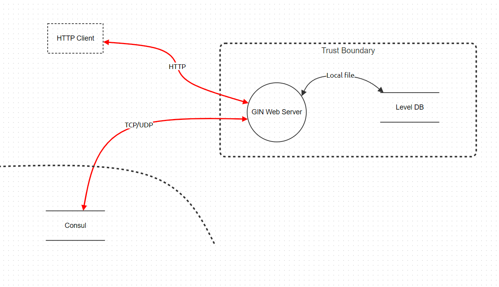
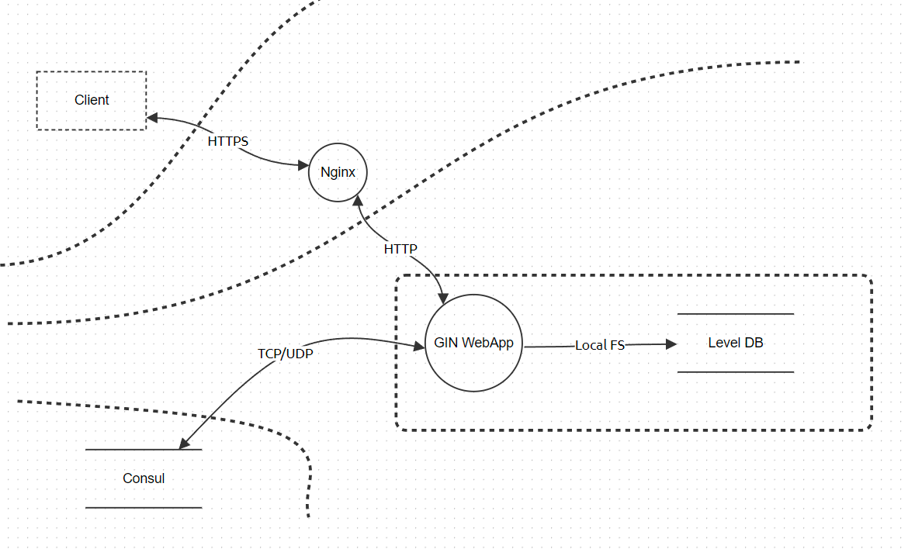

# Attack surfaces analysis and mitigations

## Analysis

Main concerns are pretty obvious:
- Consul DB is exposed to the internet
- Connection to the DB is not encrypted
- Client to server communication is not encrypted

## Mitigations

Measures taken:
- Only Nginx proxy is exposed to the internet
- Only 443 port of Nginx is exposed
- Nginx is configured to use SSL only
- Nginx proxies only specific requests to the server
- Only Server's 8080 is exposed to Nginx
- Server and DBs run in the local network
